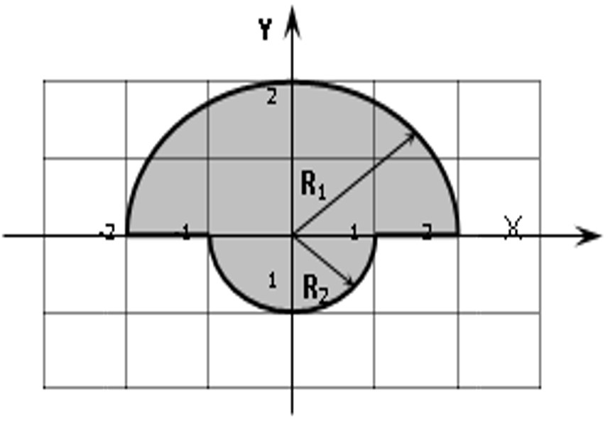

Self 03. Задание 3.

Составить программу, проверяющую попадание точки в заданную область. Область задана на рисунке заштрихованной фигурой. Координаты точки X и Y ввести с клавиатуры. Вывести на экран одно из сообщений: 
о попадании точки во внутрь области;
о попадании точки на границу области;
о не принадлежности точки области.
namespace self02
{
    internal class Program
    {
        static void Main(string[] args)
        {
            string ans;
            double x = double.Parse(Console.ReadLine()), y = double.Parse(Console.ReadLine());
            if (y > 0)
            {
                if (Math.Sqrt(x * x + y * y) < 2)
                {
                    ans = "Точка внутри круга";
                }
                else
                {
                    if (Math.Sqrt(x * x + y * y) == 2)
                    {
                        ans = "Точка на границе круга";
                    }
                    else
                    {
                        ans = "Точка не принадлежит кругу";
                    }
                }
            }
            else
            {
                if (y == 0 && Math.Abs(x) >= 1 && Math.Abs(x) <= 2)
                {
                    ans = "Точка на границе круга";
                }
                else
                {
                    if (Math.Sqrt(x * x + y * y) < 1)
                    {
                        ans = "Точка внутри круга";
                    }
                    else
                    {
                        if (Math.Sqrt(x * x + y * y) == 1)
                        {
                            ans = "Точка на границе круга";
                        }
                        else
                        {
                            ans = "Точка не принадлежит кругу";
                        }
                    }
                }
            }
            Console.WriteLine(ans);
        }
    }
}
