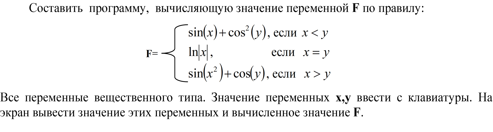

Self 04. Задание 4.

Для знакомства с методами класса Math используйте документацию Microsoft (https://learn.microsoft.com/ru-ru/dotnet/api/system.math?view=net-7.0)
namespace self04
{
    internal class Program
    {
        static void Main(string[] args)
        {
            double x = double.Parse(Console.ReadLine()), y = double.Parse(Console.ReadLine()), f = 0;
            if (x < y)
            {
                f = Math.Sin(x) + Math.Pow(Math.Cos(y), 2);
            }
            else
            {
                if (x == y)
                {
                    if (x != 0)
                    {
                        f = Math.Log(Math.Abs(x));
                    }
                    else
                    {
                        Console.WriteLine("Невозможно посчитать логарифм от 0");
                        Environment.Exit(0);
                    }
                }
                else
                {
                    f = Math.Sin(x * x) + Math.Cos(y);
                }
            }
            Console.WriteLine($"{f:F4}");
        }
    }
}
