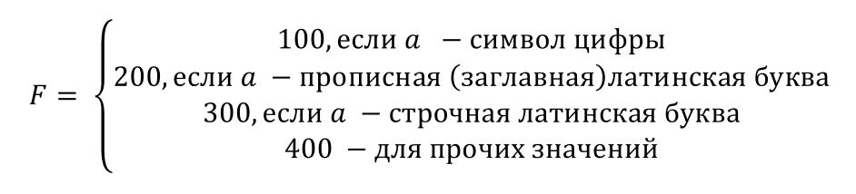

Self 01. Задание 1
На основе проекта консольного приложения, подготовить программу,  вычисляющую значение переменной 𝐹 в зависимости от символа 𝑎 (символ, вводимый пользователем) по правилу:

На экран вывести значение a и F. 
До решения задачи подумайте, какие типы переменных использовать и какие алгоритмические конструкции подходят для решения задачи
namespace task05
{
    internal class Program
    {
        static void Main(string[] args)
        {
            char a  = char.Parse(Console.ReadLine());
            switch (a)
            {
                case (>= '0' and <= '9'):
                    Console.WriteLine(a + " 100");
                    break;
                case (>= 'A' and <= 'Z'):
                    Console.WriteLine(a + " 200");
                    break;
                case (>= 'a' and <= 'z'):
                    Console.WriteLine(a + " 300");
                    break;
                default:
                    Console.WriteLine(a + " 400");
                    break;
            }
        }
    }
}
